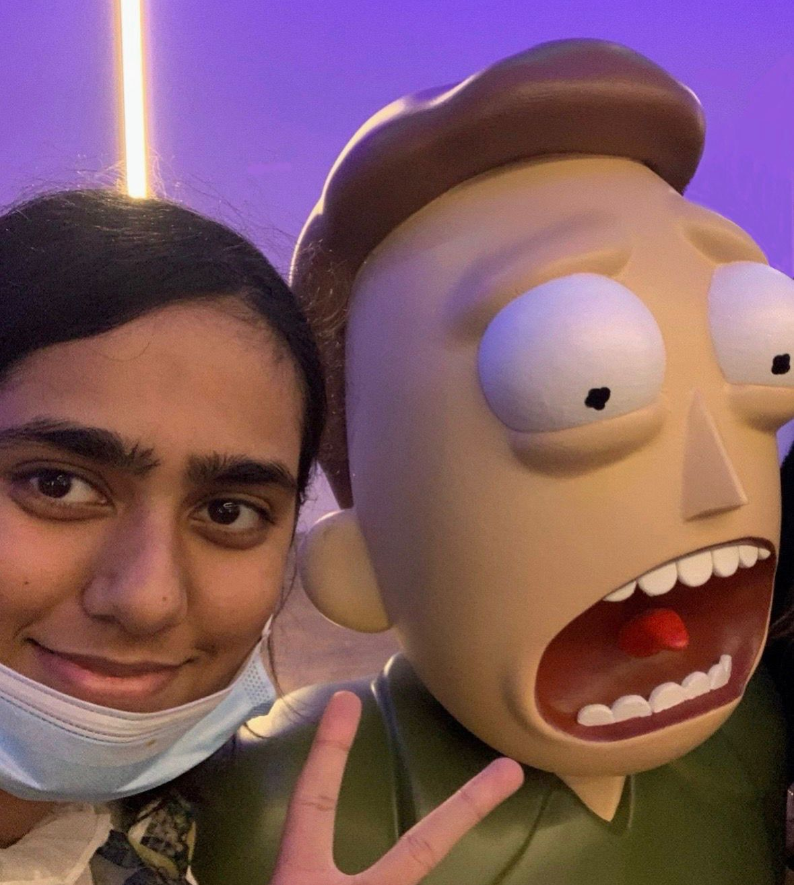

```csharp
Hi, I'm Unamta.

Computer Science student and aspiring Software Developer with hands-on experience in JavaScript, backend development, and building full-stack applications.

--- About me --------------------------

- Currently studying Computer Science in London  
- Completed a Software Development Bootcamp (Northcoders)  
- Interested in backend development, data-driven applications, and real-world problem solving  
- Actively building projects to strengthen practical skills  
- Looking for internships and junior developer opportunities  

--- Tech stack --------------------------

Languages:  
JavaScript, Python  

Frontend:  
HTML, CSS, React  

Backend:  
Node.js, Express  

Databases:  
PostgreSQL  

Tools:  
Git, GitHub, REST APIs, Agile, TDD  

--- Projects --------------------------

 NC News (Full Stack Project)
A Reddit-style news platform where users can view articles, comment, and interact with content.  
Tech: Node.js, Express, PostgreSQL, React  
- Built REST API with structured endpoints  
- Implemented database queries and relationships  
- Connected frontend and backend for full-stack functionality  

Frontend: https://github.com/Unamta/Nc-News-Frontend  
Backend: https://github.com/Unamta/Nc-News  

 Group Project – Knowva
Collaborative project focused on building a functional web application as part of a team.  
Tech: JavaScript, React  
- Worked in a team using Agile methods  
- Practiced pair programming and code reviews  

Repo: https://github.com/NC-Knowva/FE   

--- Experience --------------------------

Software Development Bootcamp – Northcoders (2025)  
- Built full-stack applications using JavaScript  
- Used TDD, pair programming, and Agile workflows  
- Strengthened debugging and problem-solving skills  

--- Currently improving --------------------------

- Backend development and APIs  
- Database design and optimisation  
- Building more polished, deployable projects  

--- Contact --------------------------

- GitHub: https://github.com/Unamta  
- LinkedIn: https://www.linkedin.com/in/unamta-aslam/  
- Email: Aslamunamta@gmail.com  
```